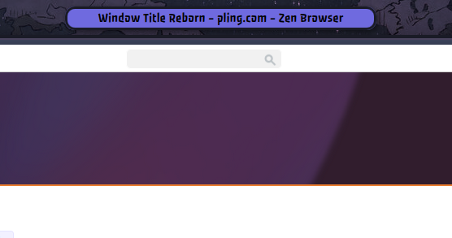
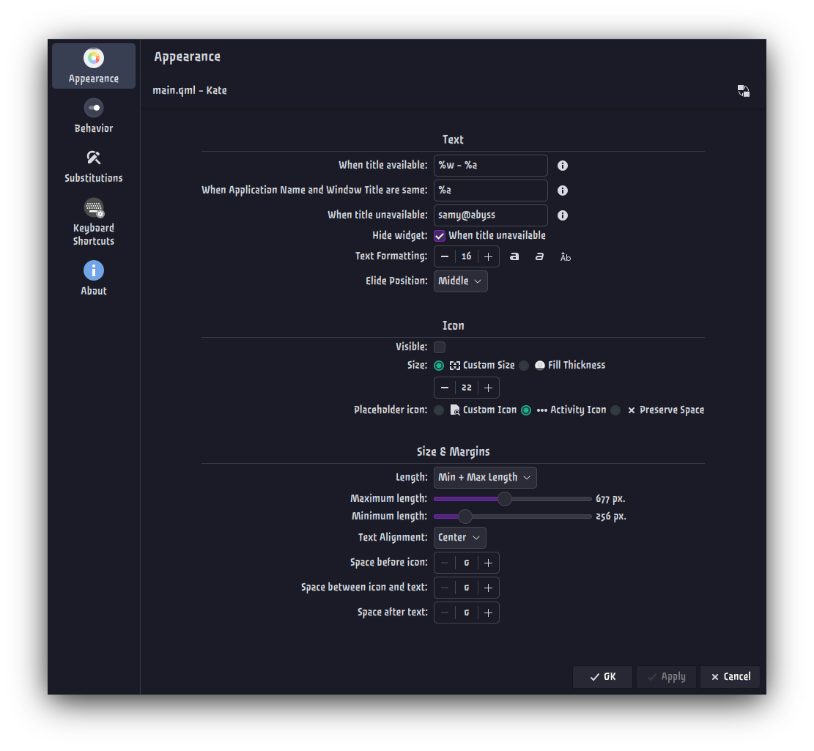
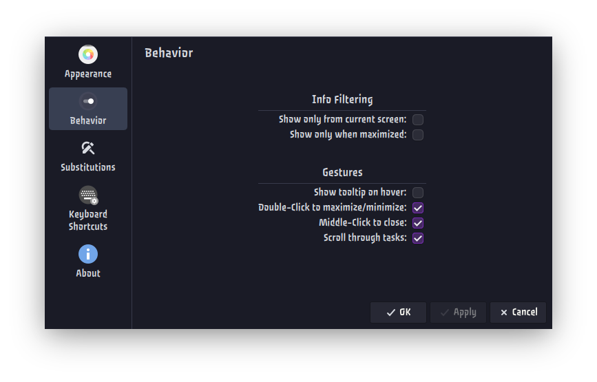
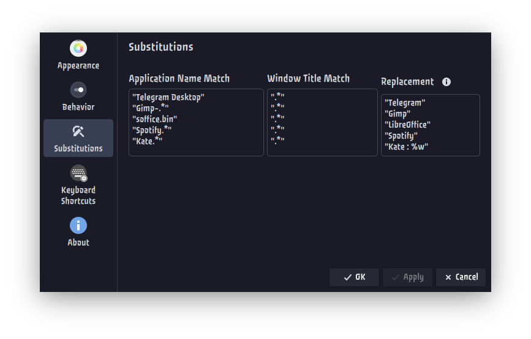

# Window Title Reborn - for KDE Plasma 6.6+

<!--  -->

A maintained fork of the [plasma6-window-title-applet](https://github.com/dhruv8sh/plasma6-window-title-applet) by Dhruvesh Surolia, revived for Plasma 6.6+ compatibility with additional features.

The original applet broke in Plasma 6.6 due to a missing `org.kde.plasma.private.appmenu` module. This reborn version removes that dependency and adds new length mode options, horizontal alignment, and more.

See it on the KDE Store: [LINK_HERE_LATER]


## Features

- Shows the **active window's title and icon** in your panel
- **Rich text substitutions**: `%a` (App Name), `%w` (Window Title), `%q` (Activity Name)
- **HTML tags** for selective bold (`<b>`), italic (`<i>`), and multi-line (`<br>/<p>`) text
- **5 widget length modes**:
  - Based on contents
  - Fixed Length
  - Maximum Length
  - **Minimum Length**
  - **Min + Max Length**
- **Horizontal text alignment**: Left, Center, or Right (for Fixed/Max length modes)
- **Hide when unavailable**: Option to completely hide the widget when no window title is present
- Configurable **icon**: custom, activity icon, or hidden
- Configurable **text formatting**: bold, italic, capitalize, font size, elide position
- Configurable **spacing**: before icon, between icon and text, after text
- **App name substitutions** via regex matching
- **Behavior options**: show on maximize only, scroll through tasks, double-click maximize/minimize, middle-click close, tooltip


## Screenshots







## Requirements

- KDE Plasma 6.6+
- KDE Frameworks 6
- Qt 6.x


## Installation

### Option 1: Install from Plasma widgets (recommended)

1. Open panel edit mode and choose **Add/Manage Widgets**.
2. Click **Get New…** → **Download New Plasma Widgets**.
3. Search for **"Window Title Reborn"**.
4. Click **Install** and add the widget to your panel.

### Option 2: Install from KDE Store download

1. Go to [LINK_HERE_LATER]
2. Open the **Files** tab and download the *Window Title Reborn* `.plasmoid` file (if applicable).
3. In Plasma, open **Add/Manage Widgets** → **Get New…** → **Install Widget From Local File**.
4. Select the downloaded `.plasmoid` file and complete the installation.

### Option 3: Install from source with kpackagetool6

```bash
git clone https://github.com/ShrekBytes/window-title-reborn.git
cd window-title-reborn
kpackagetool6 -t Plasma/Applet -i .
```

Restart plasmashell:

```bash
systemctl --user restart plasma-plasmashell
```

or log out and log back in.

### Upgrading an existing kpackagetool6 installation

From inside the project directory:

```bash
kpackagetool6 -t Plasma/Applet -u .
```

Then restart plasmashell again:

```bash
systemctl --user restart plasma-plasmashell
```

or log out and log back in.


### Uninstalling existing kpackagetool6 installation

```bash
kpackagetool6 -t Plasma/Applet -r org.kde.plasma.windowtitlereborn
```


## Text Substitutions

| Substitution | Replaced With        |
|:------------:|----------------------|
| `%a`         | Application Name     |
| `%w`         | Window Title         |
| `%q`         | Activity Name        |
| `<b>…</b>`   | Bold text            |
| `<i>…</i>`   | Italic text          |
| `<br>` / `<p>` | New line           |


## Acknowledgements

- Based on [plasma6-window-title-applet](https://github.com/dhruv8sh/plasma6-window-title-applet) by **Dhruvesh Surolia**
- Which in turn builds on the work of [Psifidotos](https://github.com/psifidotos)


## License

Licensed under the [**GNU General Public License v3.0**](LICENSE)
